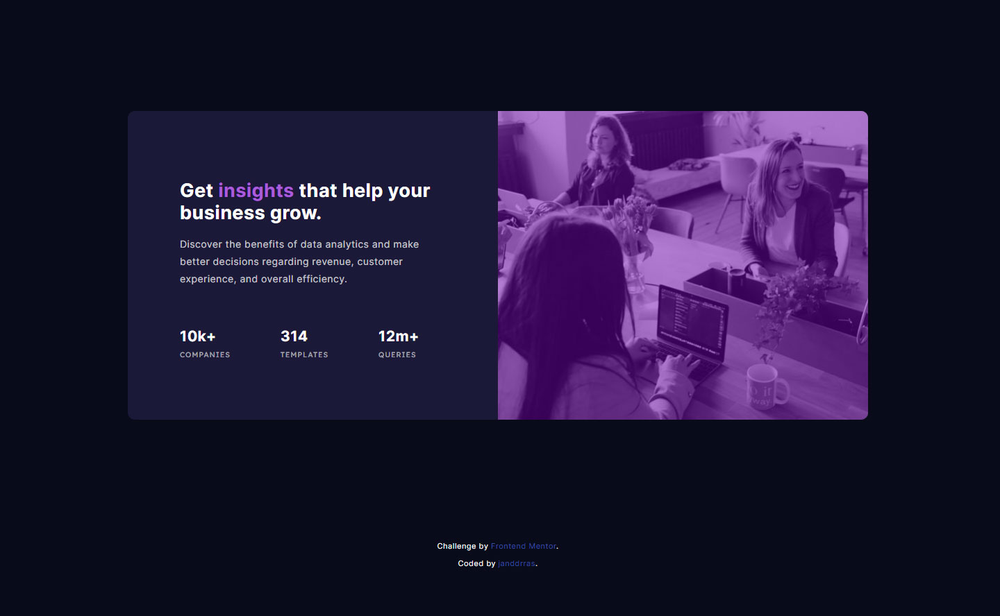

# Frontend Mentor - Stats preview card component solution

This is a solution to the [Stats preview card component challenge on Frontend Mentor](https://www.frontendmentor.io/challenges/stats-preview-card-component-8JqbgoU62). Frontend Mentor challenges help you improve your coding skills by building realistic projects. 

## Overview

### The challenge

Users should be able to:

- View the optimal layout depending on their device's screen size

### Screenshot

### Links

- Solution URL: [GitHub](https://github.com/janddrras/frontend-mentor/tree/master/stats-preview-card-component-main)
- Live Site URL: [Vercel](https://stats-preview-card-swart.vercel.app)

## My process

### Built with

- Mobile-first workflow
- [Next.js](https://nextjs.org/) - React framework
- CSS custom properties
- Flexbox
